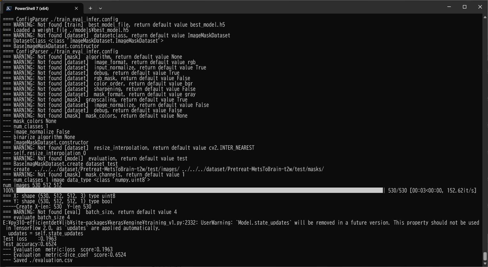
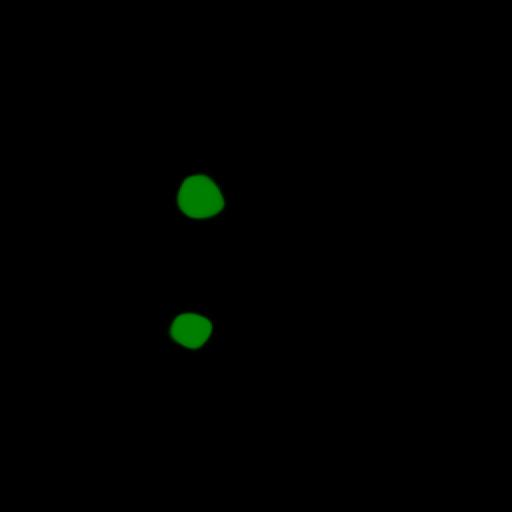
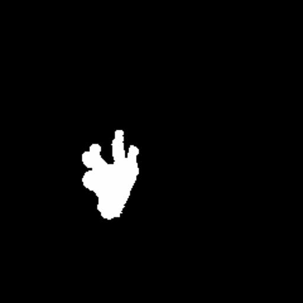

<h2>Tensorflow-Image-Segmentation-Augmented-Pretreat-MetsToBrain-T2W-MRI (2024/07/30)</h2>

This is the first experiment of Image Segmentation for <b>The Cancer Imaging Archive</b>
<a href="https://www.cancerimagingarchive.net/collection/pretreat-metstobrain-masks/">
Pretreat-MetsToBrain-Masks | A Large Open Access Dataset of Brain Metastasis 3D Segmentations on MRI 
with Clinical and Imaging Feature Information</a>, 
based on
the <a href="https://github.com/sarah-antillia/Tensorflow-Image-Segmentation-API">Tensorflow-Image-Segmentation-API</a>.  
 

The original dataset used here was obtained from The Cancer Imaging Archive
<a href="https://www.cancerimagingarchive.net/collection/pretreat-metstobrain-masks/">
link</a>.

It contains four types of image subsets: t1c, t1n, t2f and t2w. In this experiment, for simplicity, 
we focus only on the t2w subset on training process.
We applied the following image transformation methods to the original dataset to augment them during our training process. 
<ul>
<li>horizontal flipping</li>
<li>vertical flipping</li>
<li>rotation</li>
<li>shrinking</li>
<li>shearing</li>
<li>deformation</li>
<li>distortion</li>
<li>barrel distortion</li> 
</ul>
For more details, please refer to <a href="./src/ImageMaskAugmentor.py">ImageMasukAugmentor.py</a>. 
 

<b>Actual Image Segmentation</b> 
The inferred green-colorized masks predicted by our segmentation model trained on the Pretreat-MetsToBrain-t2w ImageMaskDataset 
look somewhat similar to the ground truth masks, but they lack precision in certain areas.
<table>
<tr>
<th>Input: image</th>
<th>Mask (ground_truth)</th>
<th>Prediction: inferred_mask</th>
</tr>
<tr>
<td></td>
<td></td>
<td></td>
</tr>
<tr>
<td></td>
<td></td>
<td></td>
</tr>

<tr>
<td></td>
<td></td>
<td></td>
</tr>

</table>

 
In this experiment, we have used the simple UNet Model 
<a href="./src/TensorflowUNet.py">TensorflowSlightlyFlexibleUNet</a> for this Oral Cancer Segmentation. 
As shown in <a href="https://github.com/sarah-antillia/Tensorflow-Image-Segmentation-API">Tensorflow-Image-Segmentation-API</a>.
you may try other Tensorflow UNet Models: 

<li><a href="./src/TensorflowSwinUNet.py">TensorflowSwinUNet.py</a></li>
<li><a href="./src/TensorflowMultiResUNet.py">TensorflowMultiResUNet.py</a></li>
<li><a href="./src/TensorflowAttentionUNet.py">TensorflowAttentionUNet.py</a></li>
<li><a href="./src/TensorflowEfficientUNet.py">TensorflowEfficientUNet.py</a></li>
<li><a href="./src/TensorflowUNet3Plus.py">TensorflowUNet3Plus.py</a></li>
<li><a href="./src/TensorflowDeepLabV3Plus.py">TensorflowDeepLabV3Plus.py</a></li>

 

<h3>1 Dataset Citation</h3>
The original dataset used here was obtained from 
<b><b>The Cancer Imaging Archive</b></b> 
<a href="https://www.cancerimagingarchive.net/collection/pretreat-metstobrain-masks/">
Pretreat-MetsToBrain-Masks | A Large Open Access Dataset of Brain Metastasis 3D Segmentations on MRI 
with Clinical and Imaging Feature Information
</a>.
 
 
<b>Citations & Data Usage Policy</b> 
 Data Citation Required: Users must abide by the TCIA Data Usage Policy and Restrictions. 
 Attribution must include the following citation, including the Digital Object Identifier: 
 
<b>Data Citation</b> 
Ramakrishnan, D., Jekel, L., Chadha, S., Janas, A., Moy, H., Maleki, N., Sala, M., Kaur, M.,  
Petersen, G. C., Merkaj, S., von Reppert, M., Baid, U., Bakas, S., Kirsch, C., Davis, M., Bousabarah, K., 
 Holler, W., Lin, M., Westerhoff, M., Aneja, S., Memon, F., Aboian, M.  
 (2023). A Large Open Access Dataset of Brain Metastasis 3D Segmentations on MRI with Clinical and Imaging  
 Feature Information (Version 1) [dataset].  
 The Cancer Imaging Archive. DOI: https://doi.org/10.7937/6be1-r748 
 

 
<h3>2 Pretreat-MetsToBrain-t2w ImageMask Dataset</h3>
<h3>2.1 Download original dataset</h3>
 If you would like to train this Pretreat-MetsToBrain-t2w Segmentation model by yourself,
please download the original dataset from <b>The Cancer Imaging Archive</b>
<a href="https://www.cancerimagingarchive.net/collection/pretreat-metstobrain-masks/">
Pretreat-MetsToBrain-Masks | A Large Open Access Dataset of Brain Metastasis 3D Segmentations on MRI 
with Clinical and Imaging Feature Information</a>
, and move the downloaded <b>Pretreat-MetsToBrain-Masks</b> under <b>./generator</b> directory as shown below. 
<pre>
./generator
├─Pretreat-MetsToBrain-Masks
│  ├─BraTS-MET-00086-000
│  ├─BraTS-MET-00089-000
  ...       

│  ├─BraTS-MET-00176-000
├─ImageMaskDatasetGenerator.py
└─split_master.py
     
</pre>
<h3>2.2 Generate ImageMask Dataset</h3>
Please move to <b>./generator</b> folder, and run the following  command for <a href="./generator/ImageMaskDatasetGenerator.py">ImageMaskDatasetGenerator.py
</a>
<pre>
>python ImageMaskDatasetGenerator.py
</pre> 

The constructor ImageMaskDatasetGenerator of ImageMaskDatasetGenerator class takes some parameters as shown below.

<pre>
if __name__ == "__main__":
  try:
    input_dir  = "./Pretreat-MetsToBrain-Masks"
    # Default type = "t2w"
    type = "t2w"
    if len(sys.argv) == 2:
      type = sys.argv[1]
      
    types = ["t1w", "t1c", "t1n", "t2f", "t2w", ]
    if not type in types:  
      error = "Invalid type:"
      raise Exception(error)
    
    output_dir = "./Pretreat-MetsToBrain-"+ type + "-master"

    # Enabled image_normalize flag 
    image_normalize = True

    # Enabled exclude_empty_mask     
    exclude_empty_mask = True
    
    # Rotation angle
    rotation_angle = 90

    # Resize pixel value
    resize         = 512

    generator = ImageMaskDatasetGenerator(input_dir=input_dir, type=type, output_dir=output_dir, 
                                          image_normalize = image_normalize, 
                                          exclude_empty_mask = exclude_empty_mask,
                                          rotation_angle  = rotation_angle,
                                          resize = resize)
    generator.generate()
  except:
    traceback.print_exc()                                          
</pre>
You can specify a type in the types list 
<pre>
types = ["t1w", "t1c", "t1n", "t2f", "t2w" ]
</pre>
as a command line parameter as shown below. 
<pre>
>python ImageMaskDatasetGenerator.py t2w
</pre>
By this command, <b>Pretreat-MetsToBrain-t2w-master</b> dataset will be created in generator folder. 
<pre>
./Pretreat-MetsToBrain-t2w-master
├─images
└─masks
</pre>

<h3>2.3 Split master</h3>
Please run the following command for Python script <a href="./generator/split_master.py">split_master.py</a>.
<pre>
>python split_master.py
</pre>

By this command, JPEG <b>Pretreat-MetsToBrain-t2w</b> dataset will be created under <b>./dataset</b> folder. 
<pre>
./dataset
└─Pretreat-MetsToBrain-t2w
    ├─test
    │   ├─images
    │   └─masks
    ├─train
    │   ├─images
    │   └─masks
    └─valid
        ├─images
        └─masks
</pre>

<b>Pretreat-MetsToBrain-t2w Dataset Statistics</b> 
 
 

 
<b>Train_images_sample</b> 

 
<b>Train_masks_sample</b> 

 

<h3>3 Train TensorflowUNet Model</h3>
 We have trained Pretreat-MetsToBrain-t2w TensorflowUNet Model by using the following
<a href="./projects/TensorflowSlightlyFlexibleUNet/Pretreat-MetsToBrain-t2w/train_eval_infer.config"> <b>train_eval_infer.config</b></a> file.  
Please move to ./projects/Pretreat-MetsToBrain-t2w and run the following bat file. 
<pre>
>1.train.bat
</pre>
This simply runs the following command. 
<pre>
>python ../../../src/TensorflowUNetTrainer.py ./train_eval_infer.config
</pre>

<pre>
; train_eval_infer.config
; 2024/07/29 (C) antillia.com

[model]
model          = "TensorflowUNet"
generator      = True
image_width    = 512
image_height   = 512
image_channels = 3
input_normalize = False
normalization  = True
num_classes    = 1
base_filters   = 16
base_kernels   = (7,7)
num_layers     = 8
dropout_rate   = 0.05
learning_rate  = 0.0001
clipvalue      = 0.5
dilation       = (1,1)
;loss           = "bce_iou_loss"
loss           = "bce_dice_loss"
;metrics        = ["binary_accuracy"]
metrics        = ["dice_coef"]
show_summary   = False

[train]
epochs        = 100
batch_size    = 2
steps_per_epoch  = 300
validation_steps = 100
patience      = 10

;metrics       = ["iou_coef", "val_iou_coef"]
metrics       = ["dice_coef", "val_dice_coef"]
;metrics       = ["binary_accuracy", "val_binary_accuracy"]

model_dir     = "./models"
eval_dir      = "./eval"
image_datapath = "../../../dataset/Pretreat-MetsToBrain-t2w/train/images/"
mask_datapath  = "../../../dataset/Pretreat-MetsToBrain-t2w/train/masks/"

;Inference execution flag on epoch_changed
epoch_change_infer     = True

; Output dir to save the inferred masks on epoch_changed
epoch_change_infer_dir =  "./epoch_change_infer"

;Tiled-inference execution flag on epoch_changed
epoch_change_tiledinfer     = False

; Output dir to save the tiled-inferred masks on epoch_changed
epoch_change_tiledinfer_dir =  "./epoch_change_tiledinfer"

; The number of the images to be inferred on epoch_changed.
num_infer_images       = 1
create_backup  = False

learning_rate_reducer = True
reducer_factor     = 0.2
reducer_patience   = 4
save_weights_only  = True

[eval]
image_datapath = "../../../dataset/Pretreat-MetsToBrain-t2w/valid/images/"
mask_datapath  = "../../../dataset/Pretreat-MetsToBrain-t2w/valid/masks/"

[test] 
image_datapath = "../../../dataset/Pretreat-MetsToBrain-t2w/test/images/"
mask_datapath  = "../../../dataset/Pretreat-MetsToBrain-t2w/test/masks/"

[infer] 
images_dir    = "./mini_test/images"
output_dir    = "./mini_test_output"

[segmentation]
colorize      = True
black         = "black"
white         = "green"
blursize      = None

[image]
color_converter = None
gamma           = 0

[mask]
blur      = False
blur_size = (3,3)
binarize  = False
;threshold = 128
threshold = 80

[generator]
debug        = False
augmentation = True

[augmentor]
vflip    = True
hflip    = True
rotation = True
angles   = [90, 180, 270, 300,]
shrinks  = [0.7, 0.9]
shears   = [0.1]

deformation = True
distortion  = True
sharpening  = False
brightening = False
barrdistortion = True

[deformation]
alpah     = 1300
sigmoids  = [8.0, 9.0]

[distortion]
gaussian_filter_rsigma= 40
gaussian_filter_sigma = 0.5
distortions           = [0.02,0.03]

[barrdistortion]
radius = 0.3
amount = 0.3
centers =  [(0.3, 0.3), (0.7, 0.3), (0.5, 0.5), (0.3, 0.7), (0.7, 0.7)]

[sharpening]
k        = 1.0

[brightening]
alpha  = 1.2
beta   = 10  
</pre>

<b>Model parameters</b> 
Defined small <b>base_filters</b> and large <b>base_kernels</b> for the first Conv Layer of Encoder Block of 
<a href="./src/TensorflowUNet.py">TensorflowUNet.py</a> 
and large num_layers (including a bridge between Encoder and Decoder Blocks).
<pre>
[model]
base_filters   = 16 
base_kernels   = (7,7)
num_layers     = 8
</pre>

<b>Online augmentation</b> 
Enabled our online augmentation.  
<pre>
[model]
model         = "TensorflowUNet"
generator     = True
</pre>

<b>Loss and metrics functions</b> 
Specified "bce_dice_loss" and "dice_coef".
<pre>
[model]
loss           = "bce_dice_loss"
metrics        = ["dice_coef"]
</pre>
<b>Learning rate reducer callback</b> 
Enabled learing_rate_reducer callback. 
<pre> 
[train]
learning_rate_reducer = True
reducer_factor     = 0.2
reducer_patience   = 4
</pre>
<b>Early stopping callback</b> 
Enabled early stopping callback with patience parameter.
<pre>
[train]
patience      = 10
</pre>

<b>Epoch change inference callback</b> 
Enabled EpochChange infer callback.
<pre>
[train]
epoch_change_infer     = True
epoch_change_infer_dir =  "./epoch_change_infer"
num_infer_images       = 1
</pre>
By using this EpochChangeInference callback, on every epoch_change, the inference procedure can be called
 for an image in <b>mini_test</b> folder. This will help you confirm how the predicted mask changes at each epoch during your training process.    

<b>Epoch_change_inference output</b> 
 
 
 
In this case, the training process stopped at epoch 66 by EarlyStopping Callback as shown below. 
<b>Training console output</b> 
 
 
 
<a href="./projects/TensorflowSlightlyFlexibleUNet/Pretreat-MetsToBrain-t2w/eval/train_metrics.csv">train_metrics.csv</a> 
 

 
<a href="./projects/TensorflowSlightlyFlexibleUNet/Pretreat-MetsToBrain-t2w/eval/train_losses.csv">train_losses.csv</a> 
 

 

<h3>4 Evaluation</h3>
Please move to a <b>./projects/TensorflowSlightlyFlexibleUNet/Pretreat-MetsToBrain-t2w</b> folder, 
and run the following bat file to evaluate TensorflowUNet model for Pretreat-MetsToBrain-t2w. 
<pre>
./2.evaluate.bat
</pre>
This bat file simply runs the following command.
<pre>
python ../../../src/TensorflowUNetEvaluator.py ./train_eval_infer_aug.config
</pre>

<b>Evaluation console output</b> 

  

<a href="./projects/TensorflowSlightlyFlexibleUNet/Pretreat-MetsToBrain-t2w/evaluation.csv">evaluation.csv</a> 

The loss (bce_dice_loss) for this test set of <b>Pretreat-MetsToBrain-t2w</b> dataset is not so low, 
and dice_coef not high. 
<pre>
loss,0.1963
dice_coef,0.6524
</pre>

<h3>
5 Inference
</h3>
Please move to a <b>./projects/TensorflowSlightlyFlexibleUNet/Pretreat-MetsToBrain-t2w</b> folder 
,and run the following bat file to infer segmentation regions for images by the Trained-TensorflowUNet model for Pretreat-MetsToBrain-t2w. 
<pre>
./3.infer.bat
</pre>
This simply runs the following command.
<pre>
python ../../../src/TensorflowUNetInferencer.py ./train_eval_infer_aug.config
</pre>

<b>mini_test_images</b> 
 
<b>mini_test_mask(ground_truth)</b> 
 

<b>Inferred test masks</b> 
 
 

<b>Enlarged Images and Masks Comparison</b> 
<table>
<tr>
<th>Image</th>
<th>Mask (ground_truth)</th>
<th>Inferred-mask</th>
</tr>

<tr>
<td></td>
<td></td>
<td></td>
</tr>

<tr>
<td></td>
<td></td>
<td></td>
</tr>

<tr>
<td></td>
<td></td>
<td></td>
</tr>

<tr>
<td></td>
<td></td>
<td></td>
</tr>

<tr>
<td></td>
<td></td>
<td></td>
</tr>

</table>

 
 

<h3>
Reference
</h3>
<b>1. A Large Open Access Dataset of Brain Metastasis 3D Segmentations on MRI with Clinical and Imaging
 Feature Information </b> 

Ramakrishnan, D., Jekel, L., Chadha, S., Janas, A., Moy, H., Maleki, N., Sala, M., Kaur, M.,  
Petersen, G. C., Merkaj, S., von Reppert, M., Baid, U., Bakas, S., Kirsch, C., Davis, M., Bousabarah, K., 
 Holler, W., Lin, M., Westerhoff, M., Aneja, S., Memon, F., Aboian, M.  
 The Cancer Imaging Archive.  
 DOI: <a href="https://doi.org/10.7937/6be1-r748">https://doi.org/10.7937/6be1-r748</a> 

 
